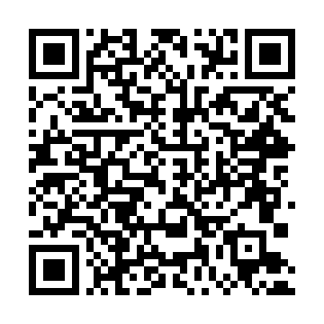

# 수리경제학 - 행렬, 미분
 
<!-- Original 강의평가 link (commented out) -->
<!-- [강의평가](https://docs.google.com/forms/d/e/1FAIpQLSc7EUraYoKooXCu_Vzh-HTljYHvz4-x8A69LS1J9gyoCDzx8A/viewform?usp=dialog) -->

### 🪄 [강의평가 바로가기](https://docs.google.com/forms/d/e/1FAIpQLSc7EUraYoKooXCu_Vzh-HTljYHvz4-x8A69LS1J9gyoCDzx8A/viewform?usp=dialog) 🪄

 

### 📨 [seanjslee@yu.ac.kr](mailto:seanjslee@yu.ac.kr)

 

## 행렬

행렬리뷰 강의자료 [pdf](lecture_slides/LinearAlgebra.pdf)

## 미분

미분 강의자료 1 (4/17) [pdf](lecture_slides/diff_short_polynomial_power.pdf)

미분 강의자료 2 (4/29) [pdf](lecture_slides/diff_after_mid_term.pdf)

## 중간고사 풀이

중간고사 풀이 [pdf](lecture_slides/mid_term_solution.pdf)

<!-- 극한 강의자료 [pdf](lecture_slides/differentiation_part1_limits.pdf)

미분 강의자료 [pdf](lecture_slides/differentiation_part2.pdf) -->

## 개념익히기에 추천!

YouTube "3Brown1Blue 한국어" - [선형대수학](https://www.youtube.com/watch?v=ic_hG2M2nG0&list=PLkoaXOTFHiqhVDo0nWybNmihCP_4BjOFR)

YouTube "3Brown1Blue 한국어" - [미적분](https://www.youtube.com/watch?v=In7fzo1JdHE&list=PLkoaXOTFHiqjfsanyvicarnZv-YLC8QN-)